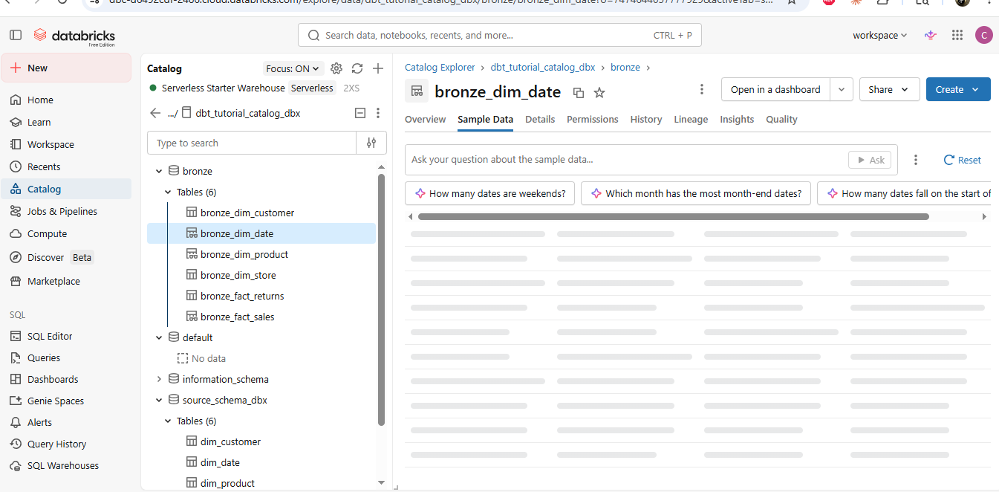

# Prasoon DBT Learning Project

A hands-on DBT project built while following a DBT tutorial, using **Databricks Free Edition** (Serverless SQL Compute) as the data platform.

## Project Structure

```
prasoon_dbt_cli/
├── models/
│   ├── source/          # Source definitions (sources.yml)
│   └── bronze/          # Raw/ingested layer models
├── macros/              # Custom Jinja macros (e.g. generate_schema_name)
├── profiles-sample.yml  # Safe sample profile (no credentials)
└── dbt_project.yml      # Project-level configuration
```

## Setup

1. Copy `profiles-sample.yml` to `profiles.yml` and fill in your Databricks credentials.
2. `profiles.yml` is gitignored — never commit it.
3. Run `dbt debug` to verify the connection.

## Data Architecture

This project demonstrates **bronze layer transformation** using Databricks and DBT:

### Raw Source Layer (External to DBT)
- **source_schema_dbx**: Raw data ingested from source systems using REST API or other ingestion tools
  - Raw dimension tables: `dim_customer`, `dim_date`, `dim_product`, `dim_store`
  - Raw fact tables: `fact_returns`, `fact_sales`

### Bronze Layer (Transformed by DBT)
- **bronze**: DBT transforms and standardizes raw source tables, creating the bronze layer
  - Bronze dimension tables: `bronze_dim_customer`, `bronze_dim_date`, `bronze_dim_product`, `bronze_dim_store`
  - Bronze fact tables: `bronze_fact_returns`, `bronze_fact_sales`

**Data Flow:** `source_schema_dbx` (raw) → **DBT transformation** → `bronze` (standardized)

The custom schema configuration in `dbt_project.yml` routes all bronze models to the `bronze` schema:

```yaml
models:
  prasoon_dbt_cli:
    bronze:
      +materialized: table
      schema: bronze
```

This configuration ensures DBT reads from `source_schema_dbx` (raw data) and writes to the `bronze` schema (transformed data).

### Visualization



The screenshot shows the Databricks catalog demonstrating the bronze layer transformation:
- **Left sidebar:** `source_schema_dbx` with raw tables (`dim_customer`, `dim_date`, `dim_product`)
- **Left sidebar:** `bronze` schema with transformed tables (`bronze_dim_customer`, `bronze_dim_date`, etc.)
- **Compute:** Serverless Starter Warehouse (2XS) running on Databricks Free Edition

## Key Commands

```bash
dbt run                          # Run all models
dbt run --select bronze_dim_date # Run a single model
dbt run --select models/bronze/  # Run all bronze models
dbt test                         # Run all tests
dbt clean                        # Remove target/ and dbt_packages/
```

## Learning Notes

See [NOTES.md](NOTES.md) for concept summaries covering DBT models, configurations, custom schemas, and node selection.

## Changelog

See [CHANGELOG.md](CHANGELOG.md) for a history of what was added or changed.
